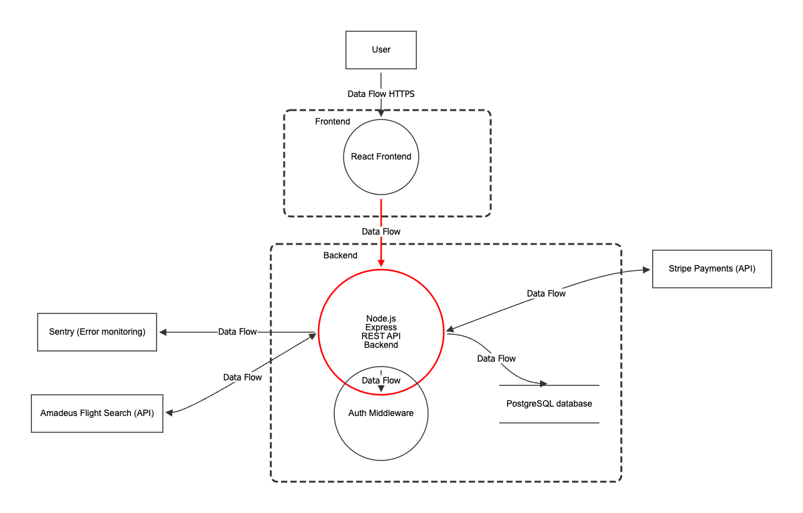

# Travel App - backend

The idea and the goal of this project is to create a backend of a website that allows users to search for a good and affordable travel app. The project will allow users to easily combine transportation modes to get from point A to point B is the most affordable way possible (for example, sometimes the cheapest way is taking a train and then switching to a plane).

### Current state

The current state of the project allows user to browse through flights, book them and see their booking info in one website. Currently it is in development and do not yet combine travel modes but is setting up architecture to later be able to add this functionality.

## The tech stack

The project is a typical client-server architecture split across two separate subprojects. The backend part is build using Node.js, Express and Typescript. For data storing PostgreSQL database is integrated using Drizzle ORM. There is also Amadeus API for flight data, Stripe for payments and Sentry for error monitoring.

## How to clone this project locally

#### Prerequisites

The following needs to be installed before:

Node.js;
PostgreSQL;
git

First, clone this repository, than navigate into the folder and install dependencies:
~~~
git clone <>
cd travelappbackend
npm install
~~~

Then, duplicate .env.example, rename it .env and fill in required values:

~~~
DATABASE_URL= your PostgreSQL database URL

JWT_ACCESS_SECRET= generate 64 hex char secret
JWT_REFRESH_SECRET= generate 64 hex char secret

NODE_ENV= development or production

AMADEUS_CLIENT_ID=Amadeus API client ID
AMADEUS_SERVICE_SECRET=Amadeus API service secret

USE_MOCK= set true or false, to use mock data if Amadeus is not working

STRIPE_SECRET_KEY=Stripe API secret key (use sandbox key while testing)
STRIPE_WEBHOOK_SECRET=Stripe API webhook secret

FRONTEND_URL=URL where frontend is hosted / running
~~~

Recommendation: since Amadeus has recently started working badly, I have included a mock file I use for testing purposes. It includes flights on 15.08.2026 from Berlin (BER) to Riga (RIX). To use it, just mark USE_MOCK as true.

Make sure PostgreSQL database is running before proceeding.

Next, run database generation and migration, and start the server.

~~~
npx drizzle-kit generate
npx drizzle-kit migrate
npm run dev
~~~

### Currently implemented cyber security measures

#### JWT (JSON Web Tokens)

Both access & refresh tokens - access tokens with 15 minute life cycle and accessTokenVersion to invalidate it on logout. Refresh token with a week life cycle.

#### Secure Cookie Handling
#### HTTP Security Headers
#### Rate limiting

Both globally & even smaller limit for auth routes

#### Zod schema & manual input validation
#### Password hashing (currently bcrypt, switch to argon2 planned)
#### CORS configured
#### imported Module and Error Monitoring
#### Environment variables not hardcoded
